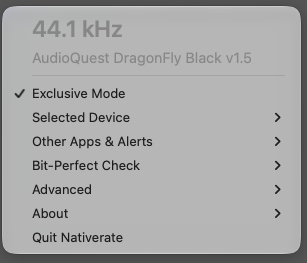

<p align="center"></p>

# Nativerate

Nativerate plays Apple Music **bit-perfect on your DAC at each track's native sample rate**, with
no resampling and no wrong-rate audio at the start of a track. It lives in the menu bar.

It started as a fork of [vincentneo/LosslessSwitcher](https://github.com/vincentneo/LosslessSwitcher)
and has grown into a separate app. It keeps upstream's sample-rate switching and adds Exclusive Mode.

<p align="center"></p>

Nativerate has two modes:

- **Switching** (upstream's approach, on by default): read Music's logs for the playing track's
  sample rate and set your output device to match.
- **Exclusive Mode** (off by default): take over the output path, described next.

## Exclusive Mode

Turn it on with "Exclusive Mode" in the menu. With it on:

- Music plays to a virtual output device, "Nativerate" (a HAL plug-in, `HALPlugin/`). The
  engine reads it and plays the audio **unchanged** to your DAC (the Output device, or your
  default output), with the DAC hogged and in its non-mixable integer format when it has one. The
  virtual device's clock follows the DAC's, so nothing is resampled.
- At a sample-rate change it catches the end of the old track, pauses Music, switches the DAC,
  rewinds and plays, so no track starts at the wrong rate. Local files and Apple Music streams both
  work. Same-rate and gapless changes pass through untouched.
- Other apps and alert sounds go elsewhere (the Mac's built-in speakers by default, your choice under Other apps and alerts), so they never mix into the DAC's stream.
- The volume keys drive the DAC's own volume and mute (4 dB per step); the audio stays at unity.
- **A DAC with no volume control** (many fixed-output DACs and some USB DACs; the keys then change nothing
  and the DAC plays at full level): mute still works, as silence. The first time you lower the volume or
  press mute on such a DAC, Nativerate says so in a notification. To make the keys work, turn on **Settings > Software
  volume** (off by default; the option appears when the last DAC held had fixed output, and a DAC
  with a volume control is never scaled, even if the option was on for a previous DAC): the keys then
  scale the output, 0 to -64 dB in 4 dB
  steps. At 0 dB the output is untouched and bit-perfect; below it the samples are scaled (and dithered
  on an integer DAC), so it is not, and Bit-perfect check says so. A 24-bit DAC playing 16-bit tracks has 8
  spare bits, so about -48 dB keeps all of the music's resolution (not with Integer Mode on: the output then has the track's depth). Or use the DAC's own knob or your amplifier's.
- Optional, off by default: **Settings > Advanced > Integer Mode** (shown only for a DAC with an integer
  format): a lossless track plays in the DAC's integer format of its own depth (16, 24 or 32 bit), so a
  DAC-side bit-perfect test sees the track's depth. With no format of that depth, the widest stays. Keep
  Music's volume at 100 and Sound Check and EQ off, or turn on TPDF dither.
- After 60 s without playback it gives the DAC and the default output back ("Settings > Release DAC when
  Music is idle"), and takes them again when Music plays (about 2 s from play to sound on the
  Babyface Pro).
- Optional, off by default: **Settings > Inter-sample overshoot protection**, a fixed -3.0 dB on
  the output for loud masters that peak above full scale between samples. With it on, the output is
  no longer bit-perfect (Bit-perfect check says so).
- A window points out Music settings that defeat bit-perfect playback (AutoMix/Crossfade, Sound
  Check, EQ, volume below 100).

The **Bit-perfect check** menu item reports whether your current path is bit-perfect and, if not, why.

**On macOS 26, Music's samples are not bit-exact to the file before they reach Nativerate.** On macOS
26.6.2 (Music 1.6.6), with every setting that changes samples off, Music's output arrives scaled by
about 0.99999997 (-0.0000003 dB): a 16-bit track lands within 0.006 of a 16-bit step of the file's
values, a 24-bit track within 1.5 steps of a 24-bit one. That is far below audibility, and Nativerate
plays what it receives to the DAC unchanged. The Bit-perfect check reports such a track as "16 bit (or
24 bit), but not bit-exact", not as a change in Music's settings. On macOS 27.0.1 (Music 1.7), the
same measurement found Music's samples equal to the file's, 16 and 24 bit, and Nativerate's output
equal to them. Both were recorded at the virtual device and compared against the decoded files. macOS 27 fixes the samples, but Music still does not switch the
DAC's rate or take the DAC for itself; Nativerate does both, for Apple Music streams as well as local files.

<p align="center"></p>

Tested on macOS 26 and 27 with a Neumann MT 48, an RME Babyface Pro, an AudioQuest DragonFly and a
MacBook Pro's speakers.
Using something else? A [hardware report](https://github.com/dizzysound/Nativerate/issues/new?template=hardware_report.yml)
takes a minute and helps the next person with the same DAC.

## Try it

Download the latest release from [Releases](https://github.com/dizzysound/Nativerate/releases).
It's ad-hoc signed and not notarized, so:

1. Unzip it into `~/Applications` (not an iCloud-synced Desktop or Documents folder).
2. Right-click **Nativerate** > **Open** the first time.
3. Quit the original LosslessSwitcher if it's running. Nativerate has its own bundle id
   (`com.dizzysound.Nativerate`; dev builds use `.dev`), so its settings start fresh and both apps can be installed.
4. In its menu (a speaker icon in the menu bar): **Install Exclusive Mode driver…** (asks for an
   administrator password; audio restarts for a moment). Exclusive Mode turns on when it's done;
   it can't be turned on without the driver.
5. Allow **Microphone** (the engine reads the virtual device's input to play it to the DAC) and
   **Automation** for Music. Each new copy of an ad-hoc build asks again.

**Coming from LosslessSwitcher or an earlier fork build?** The driver's device was called
"LosslessSwitcher" before plug-in 1.2.0. Nativerate offers the driver update on launch; accept it and
the device appears as "Nativerate" in Sound settings.

To remove it: **Settings > Exclusive Mode driver > Remove…**, then delete the app. The engine log is
`~/Library/Logs/Nativerate-ExclusiveMode.log`.

## Build it

Requirements: macOS 15 or later, Xcode 27 (the SwiftUI macros need Xcode, not just the Command
Line Tools). The build is universal; it has only been run on Apple Silicon.

```bash
git clone https://github.com/dizzysound/Nativerate.git
cd Nativerate
./scripts/typecheck/make_xcode_dev_app.sh          # bench build: ~/Desktop/Nativerate-Dev-<commit>.zip
RELEASE=1 ./scripts/typecheck/make_xcode_dev_app.sh  # release build: ~/Desktop/Nativerate-<version>.zip
```

The script runs `xcodebuild` with the dev bundle id, ad-hoc signing and the **hardened runtime
off**: with it on, library validation refuses the embedded ad-hoc `MediaRemoteAdapter.framework` at
launch. A signed, notarized build needs a Developer ID (the project's team setting is still upstream's).
The Xcode build runs `HALPlugin/build.sh` to build the plug-in into the app's Resources; see
[`HALPlugin/README.md`](HALPlugin/README.md) for building, testing and installing it by hand.

## Known issues

- Rare: one heap-corruption crash in about 45 switches on the MT 48, not reproduced under
  AddressSanitizer.
- While the engine holds the DAC, choosing that DAC in the macOS Sound menu makes Control Center
  hang until the engine lets go. Use the app's **Output device** instead.
- About 70-80 ms of latency at 44.1 kHz.
- Music's AutoMix blends tracks, so a clean switch isn't possible; turn it off.

## License and credits

Nativerate is licensed under GPL-3.0 (see `LICENSE`), as is the project it came from. The original
LosslessSwitcher is Copyright Vincent Neo and contributors; see
[upstream](https://github.com/vincentneo/LosslessSwitcher), and consider
[sponsoring its author](https://github.com/sponsors/vincentneo).

## Requirements

- macOS 15 or later, with Apple Music's Lossless mode on.
- Switching reads Music's logs through `OSLog`, so the user running Nativerate must be an **admin**.
- The app can't be sandboxed, because of how it reads those logs and talks to Core Audio.
- Use it at your own risk: the authors aren't liable for any loss or damage from using it.

## Tested devices and reports

Nativerate's tested-device list starts empty; it's built by its users. If it works for you, or
it doesn't, **open a pull request that edits this section** with a row for your setup, or an issue
if you'd rather not edit the README.

| Mac | macOS | Audio device | Nativerate version | Mode | Result |
|---|---|---|---|---|---|
| Mac with M5 Pro | 26-27 | Neumann MT 48 | pre-release, Sep 2026 | Exclusive | Works; see Known issues |
| Mac with M1 Pro | 26-27 | RME Babyface Pro | pre-release, Sep 2026 | Exclusive | Works |
| MacBook Air (M2) | 26-27 | AudioQuest DragonFly Black | pre-release, Sep 2026 | Exclusive | Works |

If something goes wrong, **attach your logs**: in the app's menu, open **About Nativerate** and choose
**Export logs…**. It writes one zip with the engine logs of the last three runs, every audio
device's state, the app's and Music's settings, the filtered system log around Core Audio and Music,
and crash reports from the last 14 days. It's built for debugging, so look inside before you post it
publicly: it lists running processes and your device names. A report with that zip attached is far
easier to act on.

## Dependencies

- [Sweep](https://github.com/JohnSundell/Sweep), by @JohnSundell, an easy-to-use Swift `String` scanner.
- [SimplyCoreAudio](https://github.com/rnine/SimplyCoreAudio), by @rnine, a framework that makes Core Audio much easier to use.
- [PrivateMediaRemote](https://github.com/PrivateFrameworks/MediaRemote), by @DimitarNestorov, for the private media remote framework.
